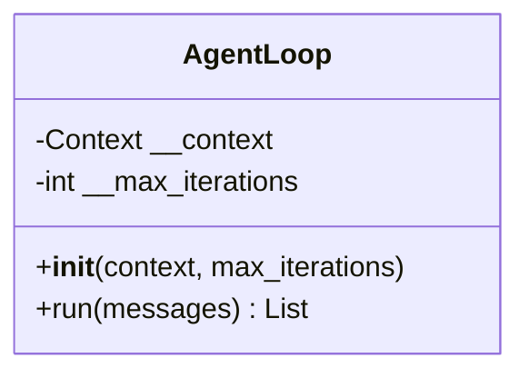
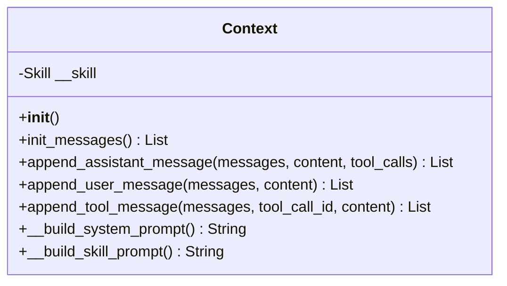
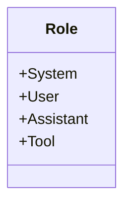
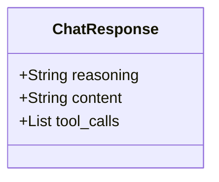
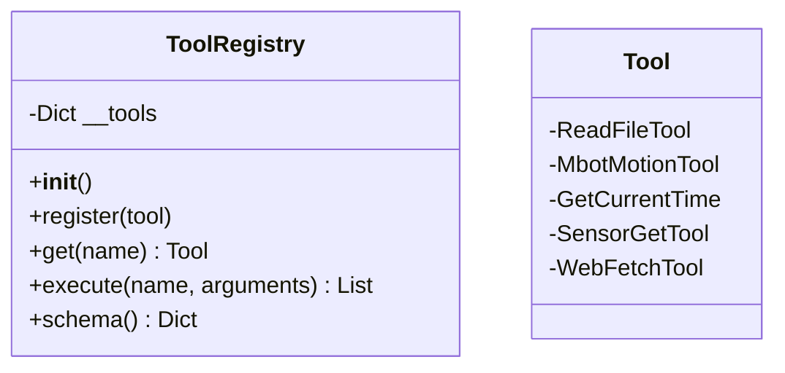
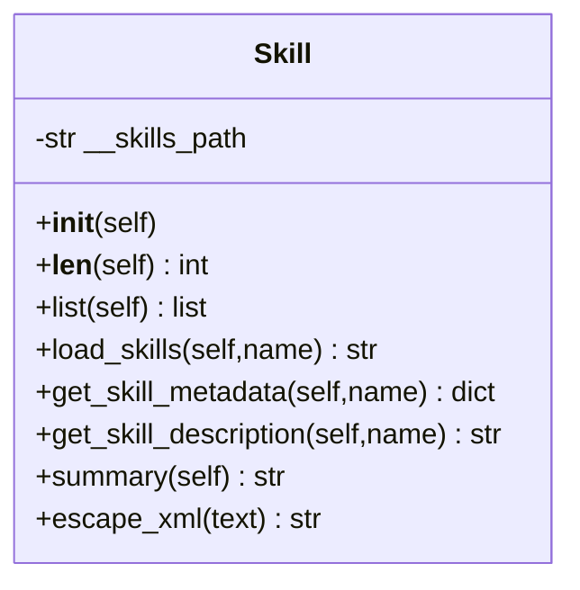
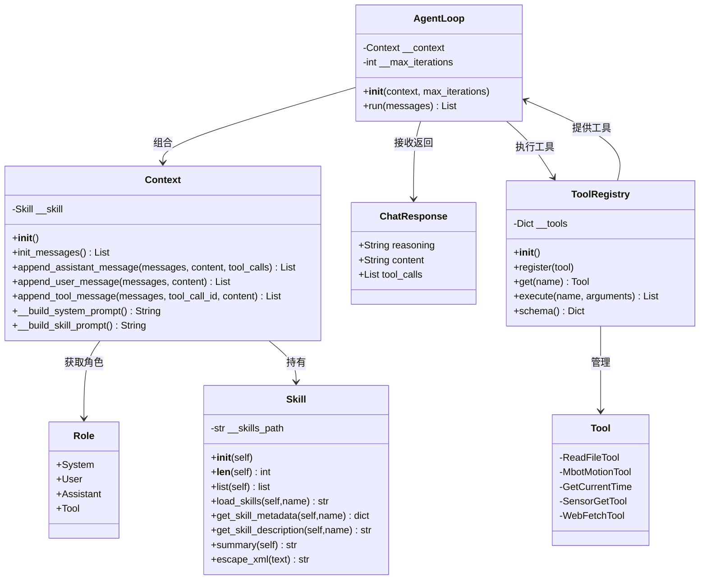

# RoBotAgent简介

* 一款极简的agent框架
## 项目架构

| 模块 | 所属路径 | 核心作用 |
|------|----------|----------|
| loop.py | RoBotAgent/agent/ | 主循环模块 |
| message_hub.py | RoBotAgent/agent/ | 消息中枢模块 |
| context.py | RoBotAgent/agent/ | 上下文管理模块 |
| prompt.py | RoBotAgent/agent/ | 提示词生成模块 |
| skill.py | RoBotAgent/agent/ | 技能模块 |
| tool/ | RoBotAgent/agent/ | 工具管理模块 |

### 主循环模块


AgentLoop 是 Agent 系统的核心调度模块，承担整个智能体运行过程的组织与控制职责。该模块内部维护两个关键属性：其一是 `__context`，用于保存当前会话上下文；其二是 `__max_iterations`，用于限制单次任务执行过程中的最大迭代次数，以避免模型连续调用工具而陷入无限循环。

在功能上，AgentLoop 的 `run(messages)` 方法是系统的主要执行入口。该方法接收初始消息列表后，首先结合 `Context` 中预定义的系统提示词和历史消息构造输入，随后调用大语言模型进行推理，并将返回结果封装为 ChatResponse 对象。若模型返回的是普通文本响应，则说明当前任务无需调用外部工具，此时系统可直接输出结果；若模型返回包含工具调用指令的 `tool_calls`，则AgentLoop 会根据工具名称和参数请求 ToolRegistry 执行相应工具，并将工具执行结果重新追加到消息列表中，再次进入下一轮推理。该过程持续迭代，直到任务完成、模型输出最终回答，或者达到最大迭代次数为止。

因此，AgentLoop 本质上实现了一种典型的 ReAct 式运行机制，即在“推理—行动—观察”的循环中逐步完成任务。这种设计使 Agent 不再局限于单轮文本问答，而具备了基于环境反馈持续修正行为的能力。

### 上下文管理模块


Context 模块在系统中承担上下文组织与消息管理职责，是连接用户输入、系统提示和工具反馈的重要中介。该模块内部持有一个 Skill 实例，用于加载和管理技能描述信息，从而支持系统在提示词中引入技能层面的先验知识。

从功能实现上看，Context 提供了多个消息维护接口，包括 `init_messages()`、`append_user_message()`、`append_assistant_message()` 和 `append_tool_message()` 等。其中，`init_messages()` 用于初始化会话消息列表；`append_user_message()` 用于将用户输入追加到上下文中；`append_assistant_message()` 用于记录大语言模型生成的回复内容及其潜在的工具调用信息；`append_tool_message()` 则用于保存工具执行结果，以供后续轮次的模型推理使用。

除此之外，Context 还包含`__build_system_prompt()` 和 `__build_skill_prompt()` 两个核心方法。前者用于构建系统级提示词，规定 Agent 的角色定位、行为边界和输出约束；后者则根据 Skill 模块中维护的技能信息，生成与当前任务相关的技能提示内容。通过将系统提示、技能提示以及多轮消息统一组织到上下文中，Context 为大语言模型提供了结构化、连续性的输入语境，从而增强了模型对任务目标和执行环境的理解能力。

### 角色定义模块


Role 模块用于定义对话过程中消息的角色类型，包括 System、User、Assistant 和 Tool 四种基本身份。其中，System 表示系统级提示信息，主要用于规定 Agent 的角色与行为方式；User 表示用户输入的原始任务指令；Assistant 表示大语言模型生成的中间推理结果或最终回复；Tool 表示外部工具执行后的返回结果。

在 Agent 运行过程中，角色信息具有重要作用。一方面，不同角色的消息在上下文中承担不同语义功能，有助于模型区分任务说明、用户需求、自身回复和外部环境反馈；另一方面，标准化的角色划分也有利于形成统一的消息格式，便于系统在多轮交互中稳定维护上下文结构。因此，Role 模块虽然结构简单，但在整个消息驱动架构中起到了规范对话语义、支撑上下文组织的重要作用。

### 模型响应对象设计


ChatResponse 用于表示大语言模型的结构化输出结果，是连接模型推理与后续执行过程的关键数据对象。该对象主要包含三个字段：reasoning、content 和 tool_calls。其中，reasoning 用于记录模型的推理过程或中间分析信息，content 表示模型生成的自然语言回复内容，tool_calls 则用于描述模型是否要求调用外部工具以及具体的调用参数。

这种结构化设计使得 Agent 可以更加清晰地区分“文本回复”和“动作请求”两种不同输出类型。如果 tool_calls 为空，则说明模型本轮只需生成回答内容；如果 tool_calls 不为空，则说明模型已经做出了行动决策，系统应进一步调用对应工具执行外部操作。通过 ChatResponse 这一中间对象，系统实现了从语言推理结果到工具执行流程的解耦，增强了模型输出的可解析性和工程可控性。

### 工具注册与调度模块设计



ToolRegistry 是系统中的工具统一管理中心，负责维护所有可调用工具的注册信息，并向 AgentLoop 提供查询、执行和模式描述等功能。该模块内部通过 __tools 字典保存工具实例，以工具名称作为索引，实现统一管理。

在功能层面，ToolRegistry 提供了 register()、get()、execute() 和 schema() 等接口。其中，register() 用于在系统启动时注册具体工具实例；get() 用于按照名称获取指定工具；execute() 用于根据工具名和参数执行相应操作，并返回执行结果；schema() 则用于生成工具模式描述信息，供大语言模型在工具调用阶段参考。这种注册式设计使系统在新增工具时无需修改主循环逻辑，只需将新工具按统一接口注册到工具中心，即可被 Agent 自动纳入调度范围。

由依赖图可知，ToolRegistry 与 AgentLoop 之间构成双向关联：一方面，AgentLoop 依赖 ToolRegistry 完成工具调用；另一方面，ToolRegistry 向 AgentLoop 提供可用工具集合及其接口描述。由此可见，ToolRegistry 是 Agent 执行外部动作能力的核心基础设施。3.X.7 工具层设计

在能力执行层面，系统通过 Tool 模块封装了一组具体的外部工具，包括ReadFileTool,MbotMotionTool,GetCurrentTime,SensorGetTool 和 WebFetchTool 等。它们分别对应文件读取、机器人运动控制、时间获取、传感器查询以及网页信息获取等基础功能。

这些工具共同构成了 Agent 的“行动能力集合”。其中，MbotMotionTool 和 SensorGetTool 主要服务于机器人实体控制与环境感知任务，是本文系统与底层硬件交互的关键接口；ReadFileTool、GetCurrentTime 和 WebFetchTool 则扩展了 Agent 的通用外部信息访问能力，有助于提升系统在复杂任务场景中的综合处理能力。所有工具均由 ToolRegistry 统一管理，从而实现工具能力的标准化调度。


### 技能模块设计


除了底层工具之外，系统还设计了 Skill 模块，用于管理技能文件及其元信息。该模块内部维护技能目录路径 __skills_path，并通过 list()、load_skills()、get_skill_metadata()、get_skill_description() 和 summary() 等方法提供技能查询、加载和描述能力。

与工具直接面向执行不同，技能更偏向于高层任务语义的组织与补充。其主要作用并不是直接调用底层硬件，而是为系统提供任务相关的先验知识和行为描述。例如，某一技能可以描述“药品分拣”的目标、执行条件、步骤概要和注意事项。这些信息可以被 Context 模块整合进系统提示词中，从而增强大语言模型对任务场景和执行意图的理解。可以认为，技能模块在系统中承担了“知识增强”和“行为约束”的双重作用，是大模型推理与工具执行之间的重要补充层。


### 各模块依赖设计



##  自定义工具

```python
class ReadFileTool(Tool):

    @property
    def name(self) -> str:
        return "read_file"

    @property
    def description(self) -> str:
        return "读取文件的文本内容"

    @property
    def parameters(self) -> Dict[str, str]:
        return {
            "type": "object",
            "properties": {
                "path": {
                    "type": "string",
                    "description": "待读取的文件路径"
                }
            },
            "required": ["path"]
        }

    async def execute(self, path: str) -> List[Dict[str, Any]]:
        file_path = Path(path)
        if not file_path.exists():
            return to_content(text=f"{file_path}路径不存在。")

        if not file_path.is_file():
            return to_content(text=f"{file_path}并不是文件。")

        content = file_path.read_text(encoding="utf-8")
        return to_content(text=content)
```

1. 在 `RoBotAgent/agent/tool/`目录下进行编写
2. 创建自定义工具，继承 `Tool`类

## 自定义skill

1. 在 `RoBotAgent/skill/`目录下进行编写


## .env 文件编写

> 参考以下,编写在`RoBotAgent/.env`文件`

```plaintext
# ollama
OLLAMA_BASE_URL="http://127.0.0.1:11434/v1/"
OLLAMA_API_KEY="ollama"
OLLAMA_MODEL="qwen3.5:9b"

```

## 部署

1. 安装 uv（如未安装）
```bash
pip install uv
```
2. 克隆项目
```bash
git clone https://github.com/CXSforHPU/RoBotAgent.git
cd RoBotAgent
```
3. 配置环境变量
在项目根目录创建 .env 文件，配置大模型服务（以 Ollama 为例）：
```plaintext
env
# Ollama 配置
OLLAMA_BASE_URL="http://127.0.0.1:11434/v1/"
OLLAMA_API_KEY="ollama"
OLLAMA_MODEL="qwen3.5:9b"
```

4. 安装依赖 & 运行

```bash
# 安装所有依赖
uv sync

# 启动agent
uv run main.py
```